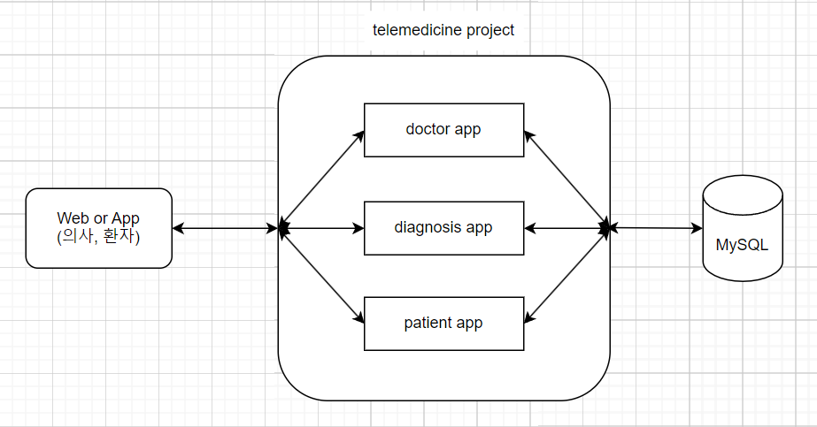
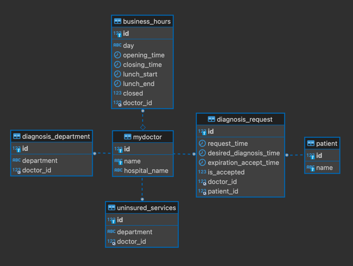

# 원격진료 프로젝트

---
## 1. 프로젝트 세팅 방법
### 1.1. 개발 환경
 - Python : 3.11
 - Django : 5.0.1
 - Django REST Framework : 3.14.0
 - MySQL : 8.2
### 1.2. 프로젝트 세팅
- Git clone을 이용하여 telemedicine repo 다운로드
> git clone https://github.com/kjuyoung/telemedicine.git

- requirements.txt를 이용하여 패키지 설치
> pip install -r requirements.txt

- djangorestframework, mysqlclient 패키지 설치
> pip install djangorestframework
>
> pip install mysqlclient

- DB 생성 후 아래 명령어 통해 스키마 적용
> python manage.py makemigrations
> 
> python manage.py migrate

***
## 2. 데이터 입력 방법
- _telemedicine.postman_collection.json_ 파일을 이용하여 아래 환자, 의사 데이터를 미리 DB에 입력
1. **환자 등록 API** (name)
2. **의사 등록 API** (name, hospital_name, diagnosis_department, uninsured_services_department, business_hours)

- 참고로 postman 설정파일 안에 예시 json 데이터를 만들어 두었습니다. 

***
## 3. 각 로직 실행 방법
### 3.1. 의사 조회
- postman 설정파일의 의사 조회 API를 이용하여 로직 실행
- 예시) 127.0.0.1:8000/doctor/?hospital_name=서울병원&name=김의사 

### 3.2. 진료 요청
- 진료 요청 API를 이용하여 진료 요청 생성 로직 실행
- 예시) 127.0.0.1:8000/diagnosis/

### 3.3. 진료 요청 검색
- 진료 요청 검색 API를 이용하여 진료 요청 생성 로직 실행
- 예시) 127.0.0.1:8000/diagnosis/?doctor_id=1

### 3.4. 진료 요청 수락
- 진료 요청 수락 API를 이용하여 진료 요청 생성 로직 실행
- 예시) 127.0.0.1:8000/diagnosis/{진료요청id}/accept/

***
## 4. 프로젝트 구조
- **프로젝트 구조**



  
- **ERD**




- **File 구조**
```
📦 telemedicine project
├─ .gitignore
├─ README.md
├─ diagnosis
│  ├─ __init__.py
│  ├─ admin.py
│  ├─ apps.py
│  ├─ migrations
│  │  ├─ 0001_initial.py
│  │  └─ __init__.py
│  ├─ models.py
│  ├─ serializers.py
│  ├─ tests.py
│  ├─ urls.py
│  └─ views.py
├─ doctor
│  ├─ __init__.py
│  ├─ admin.py
│  ├─ apps.py
│  ├─ migrations
│  │  ├─ 0001_initial.py
│  │  ├─ 0002_alter_doctor_table.py
│  │  └─ __init__.py
│  ├─ models.py
│  ├─ serializers.py
│  ├─ tests.py
│  ├─ urls.py
│  └─ views.py
├─ img.png
├─ manage.py
├─ patient
│  ├─ __init__.py
│  ├─ admin.py
│  ├─ apps.py
│  ├─ migrations
│  │  ├─ 0001_initial.py
│  │  └─ __init__.py
│  ├─ models.py
│  ├─ serializers.py
│  ├─ tests.py
│  ├─ urls.py
│  └─ views.py
├─ requirements.txt
├─ telemedicine.postman_collection.json
└─ telemedicine
   ├─ __init__.py
   ├─ asgi.py
   ├─ settings.py
   ├─ urls.py
   └─ wsgi.py
```

***
## 5. 기능
### 5.1. 의사 관련 기능 (doctor/views.py)
- 의사 데이터 저장
  - 의사정보(의사이름, 병원이름, 진료과, 비급여진료과목, 영업시간)를 입력받아 진료과, 비급여진료과목, 영업시간 객체를 각각 생성하고 일대다 관계를 갖는 각각의 DB 테이블에 저장
- 의사 데이터 조회
  - 의사이름, 병원이름, 진료과, 비급여진료과목 등 문자열 또는 특정 날짜, 시간(영업시간 검색용) 검색조건을 받아 조건에 해당하는 의사정보를 조회 후 반환하는 기능

### 5.2. 환자 관련 기능 (patient/views.py)
- 환자 데이터 저장
  - 진료요청을 하기 위해서는 환자id, 환자이름이 필요하기 때문에 환자 정보를 DB에 저장하기 위한 기능

### 5.2. 진료 요청 (diagnosis/views.py)
- 진료 요청 데이터 저장
  - 환자id, 의사id, 희망 진료시간을 입력받고, 진료요청 데이터를 생성한 후 진료요청에 대한 환자, 의사 정보와 희망 진료 시간, 진료요청 만료시간을 반환하는 기능

### 5.3. 진료 요청 검색 (diagnosis/views.py)
- 진료 요청 데이터 조회
  - 의사id를 입력으로 받고, 이미 수락된 진료요청을 제외한 특정 의사에 대한 진료요청(진료요청id, 환자이름, 진료 희망 날짜시간, 진료요청 만료 날짜시간) 리스트를 조회하여 반환하는 기능

### 5.4. 진료 요청 수락 (diagnosis/views.py)
- 진료 요청 수락
  - 진료요청id를 입력으로 받고, 해당 진료요청에 대한 수락여부를 DB 업데이트한 후 진료요청id, 환자이름, 진료 희망 날짜시간, 진료요청 만료 날짜시간을 반환하는 기

